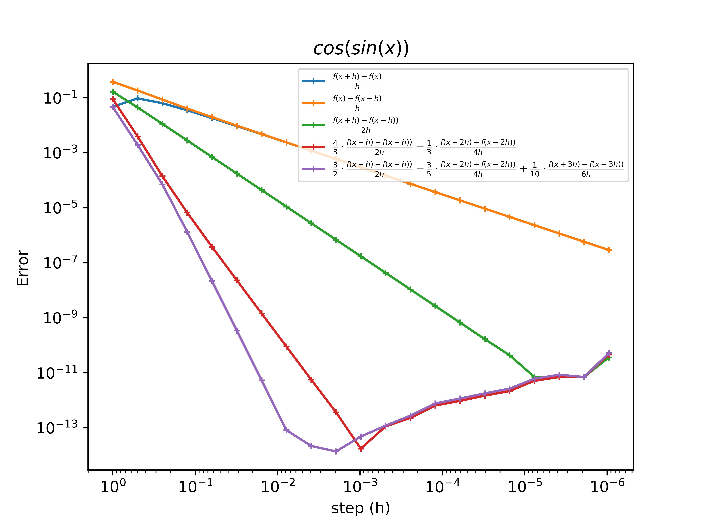

# 1 lab
## Theory
In this laboratory work absolute step error graph was built, numerical step $h_n = \frac{2}{2^n}$, $n = \overline{1,21}$ for functions $sin(x^2)$, $cos(sin(x))$, $exp(sin(cos(x)))$, $ln(x+3)$, $(x+3)^{0.5}$ 

By methods:

$\frac{f(x+h) - f(x)}{h}$

$\frac{f(x) - f(x-h)}{h}$

$\frac{f(x+h) - f(x-h)}{2h}$

$\frac{4}{3} \frac{f(x+h)-f(x-h)}{2h} - \frac{1}{3} \frac{f(x+2h) - f(x-2h)}{4h}$

$\frac{3}{2} \frac{f(x+h) - f(x-h)}{2h} - \frac{3}{5} \frac{f(x+2h) - f(x-2h)}{4h} + \frac{1}{10} \frac{f(x+3h)-f(x-3h)}{6h}$

## Results

Here you can found errors for each function for each computational error method 

