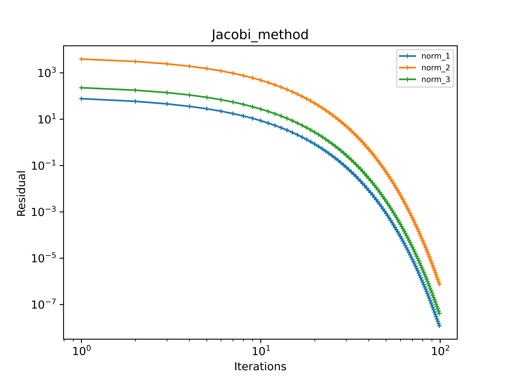
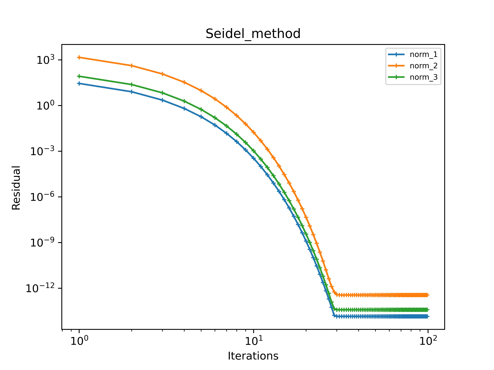
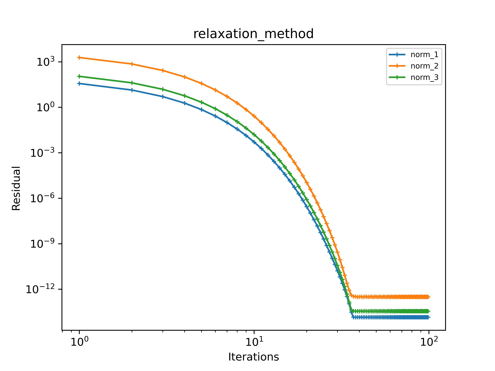

# 2 lab
## Theory
In this lab we practiced direct and iterative methods for solving a system of linear equations:

### By methods:

#### Direct:

+ Gauss method 

+ LU method

#### Iterative

+ Seidel method

+ Jacobi method

+ Relaxation method

In iterative methods was used norms of matrices:

### Norm №1

$$
    \|x\|_1 = \max\limits_{i \in {1, ..., n}} x_i
$$
$$
    \|A\|_1 = \max\limits_{i \in {1, ..., n}} \sum_{j = 1}^{n} |a_{ij}|
$$

### Norm №2

$$
    \|x\|_2 = \sum_{i = 1}^{n} |x_i|
$$

$$
    \|A\|_2 = \max\limits_{j \in {1, ..., n}} \sum_{i = 1}^{n} |a_{ij}|
$$

### Norm №3

$$
    \|x\|_3 = \sqrt{(x, x)}
$$

$$
    \|A\|_3 = \max\limits_{i \in {1, ..., n}} \sqrt{\lambda_i (A^{\ast} A)}
$$

All of results below provided for this  system of linear equations:

$$
\begin{cases}
    ax_1 + x_2 + ... + x_5 = 1 \\
    x_1 + ax_2 + x_3 + ... + x_6 = 2 \\
    x_1 + x_2 + ax_3 + x_4 + ... + x_7 = 3 \\
    x_1 + x_2 + x_3 + ax_4 + x_5 + ... + x_8 = 4 \\
    x_1 + x_2 + x_3 + x_4 + ax_5 + x_6 + ... + x_9 = 5 \\
    x_2 + x_3 + x_4 + x_5 + ax_6 + x_7 + ... + x_{10} = 6 \\
    ... \\
    x_{k - 4} + ... + x_{k - 1} + ax_k + x_{k + 1} + ... + x_{k + 4} = k \\
    ... \\
    x_{93} + ... + x_{96} + ax_{97} + x_{98} + x_{99} + x_{100} = 97 \\
    x_{94} + ... + x_{97} + ax_{98} + x_{99} + x_{100} = 98 \\
    x_{95} + ... + x_{98} + ax_{99} + x_{100} = 99 \\
    x_{96} + ... + x_{99} + ax_{100} = 100 \\
\end{cases}
$$

a = 10, matrix_size (dim) = 100

## Results
### Direct methods:

Calculate residual for LU_method:

+ residual of norm_1 = 1.4210854715202004e-14

+ residual of norm_2 = 2.4646951146678475e-13

+ residual of norm_3 = 3.2640546648415085e-14

Calculate residual for Gauss_method:

+ residual of norm_1 = 1.4210854715202004e-14

+ residual of norm_2 = 3.0397906414236786e-13

+ residual of norm_3 = 3.5915164998769465e-14

### Iterative methods:

Here you can see dependence of residual of iterations in the iterative methods.

As you can see, with a large number of iterations, all methods (I checked: for Jacobi you need more iterations) achieve maximum accuracy, which is associated with the error of computer calculations like in direct methods.

