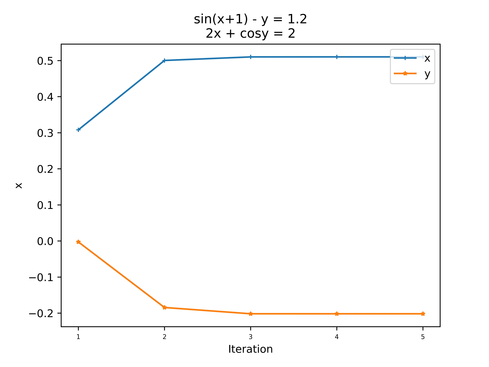

# 3 lab
## Theory
In this lab we practiced fixed point iteration and Newton iteraton methods for solving a non-linear equation and system of its:

### Non-linear equation:

$$ F(x) = 2x^2 + 5x - 3 $$

### By fixed point iteration:

1) I localized a solution by sequence of shrinking segments 
(Because of it good accuracy i set as low number of partition as i can because this method solo can find an answer)

2) Then I checked that method converges ($f'(x_k) < 1$ on all segment): 

$$ f(x_k) = x_{k+1} = \frac{-2x_{k}^2 + 3}{5}$$
$$ f'(x_k) = \frac{-4x}{5} < 1$$

3) Iterated until i haven't got solution x = 0.5

### Newton method:
$$f(x) = 0 $$
$$ x_{k+1} = x_{k} - \frac{f(x_k)}{f'(x_k)}$$
$$ x = 0.5$$

### System of non-linear equations

$$ \overline{x_{k+1}} = \overline{x_k} - J^{-1}(\overline{x_k}) f(\overline{x_k})$$

$$x = 0.51, y = -0.202$$

