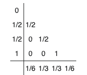
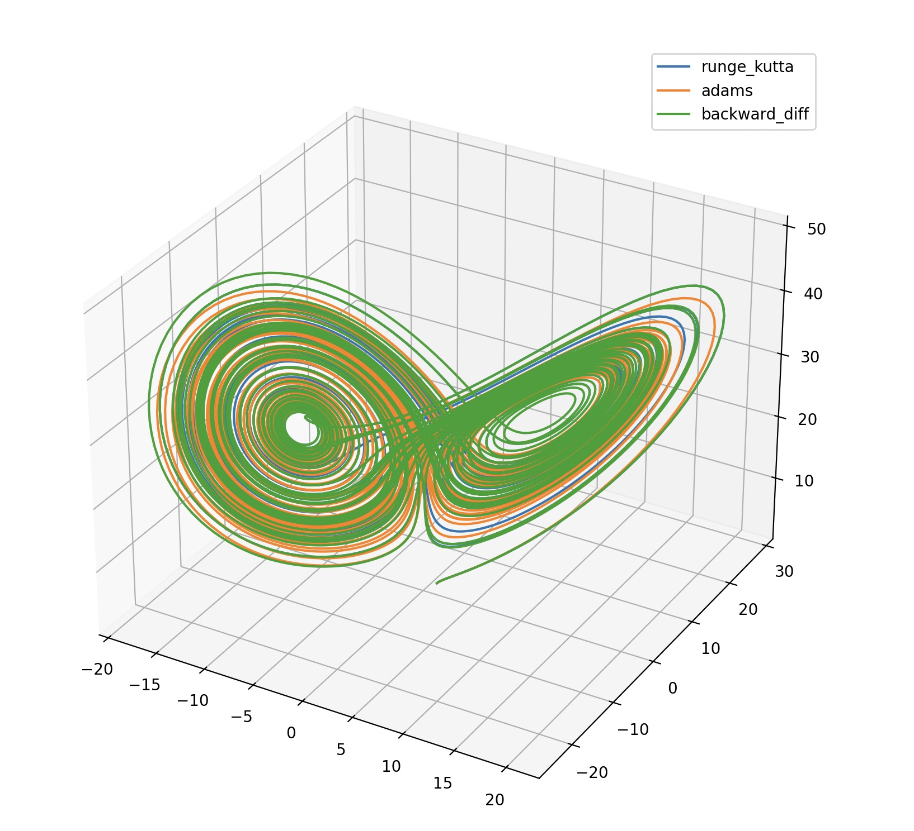
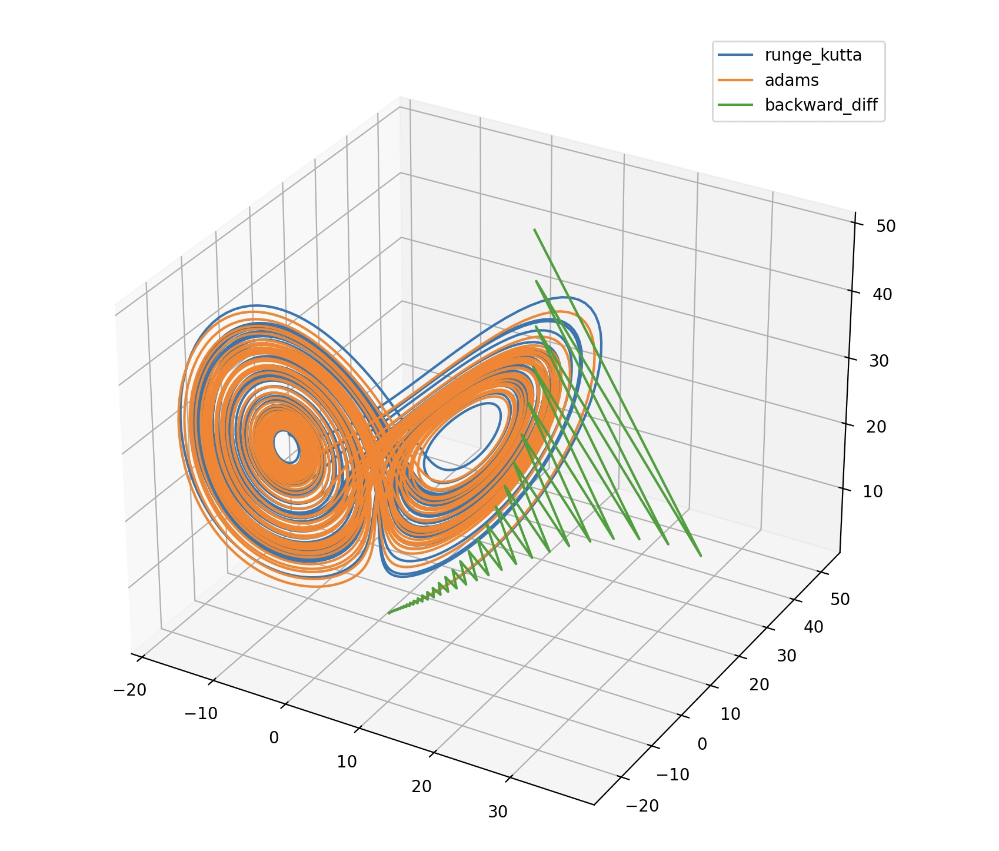

# 6 lab

## Theory
In this lab using Runge-Kutta, Adams and backward differentiation methods I numerically solve the Lorentz system with parametrs: b = 8/3, $\sigma$ = 10, r = 28, $0 <= t <= 50$

$
\begin{equation}
 \begin{cases}
   x' = -\sigma(x - y),
   \\
   y' = -xz + rx - y,
   \\
   z' = xy - bz.
 \end{cases}
\end{equation}
$
$x(0) = y(0) = z(0) = 1$

### Runge-Kutta method
$$k_i = f(t_n + c_i\tau, y_n + \tau(\sum_{j=1}^s a_{ij}k_j)), where \space i = 1,2...s \newline$$

$$y_{n+1} = y_n + \tau(\sum_{j=1}^s b_jk_j)$$

Bucherov's table for 4th order classic approximation method:

  

### Adams extrapolation
$$
y_{n+1} = y_n + \tau (\frac{3}{2}f_n - \frac{1}{2}f_{n-1})
$$

### Backward differentiation method
$$
y_{n+1} = y_n + hf_n, k =1
\\
\frac{y_{n+1} - y_{n-1}}{2h} = f_n, k = 2$$

Second-degree method diverges

## Results
For given Lorentz system:

  

Diverge of second-degree BDM method:

  

