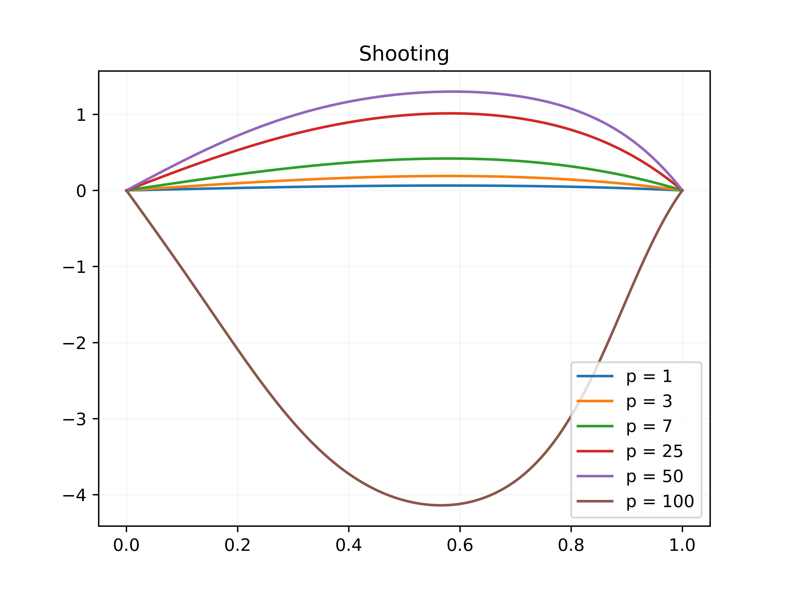
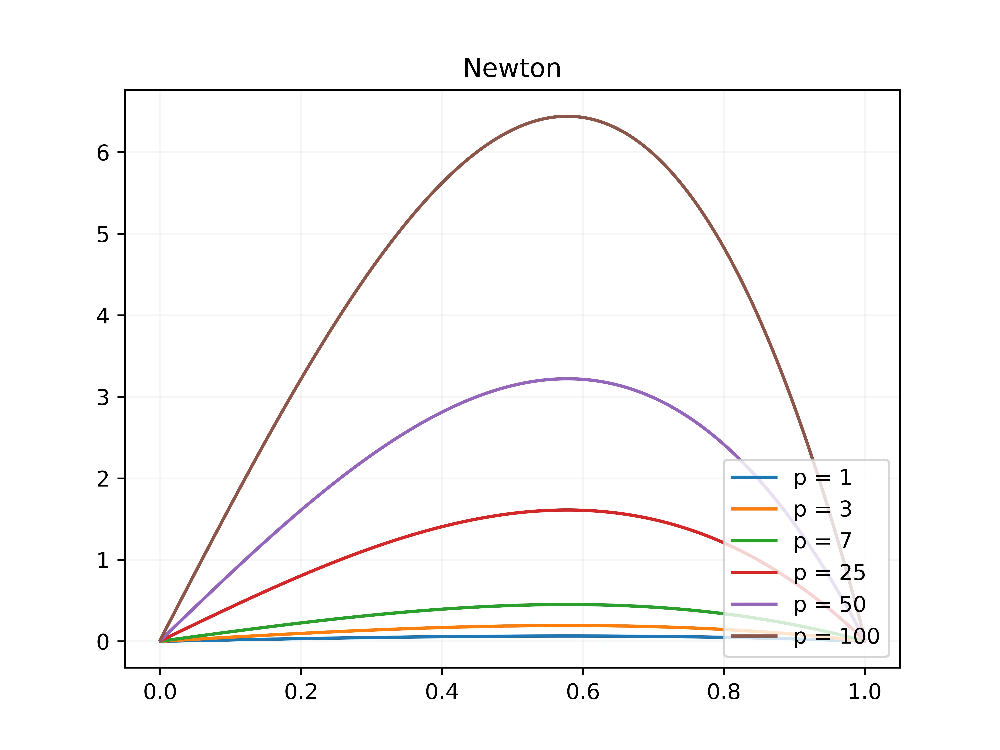
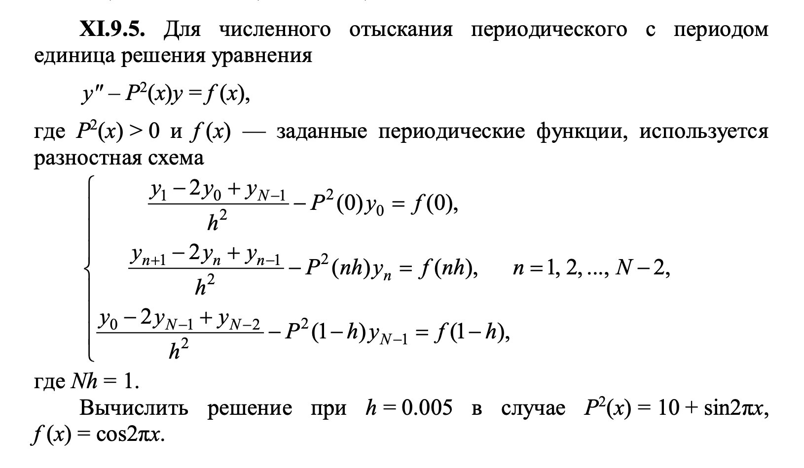
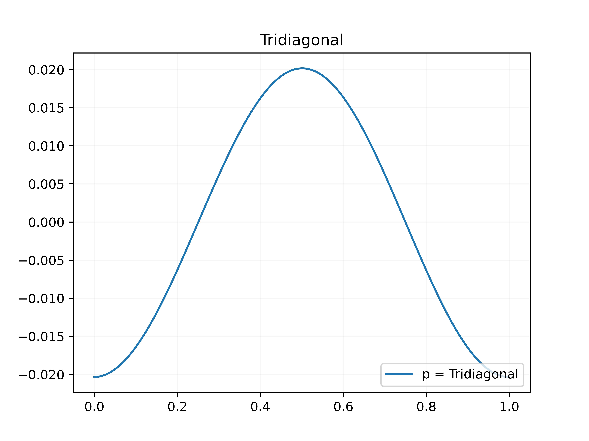

# 7 lab

## Theory
### Shooting method
In this lab using shooting method which includes Runge-Kutta from previous lab work, we will solve following equation
$$
    y'' + px\cos(y) = 0, 0 < x \leq 1,
$$
$$  
    y(0) = 0, y(1) = 0, p = 1, 4, 7, 25, 50, 100
$$
which is equivalent to:

$
\begin{equation}
 \begin{cases}
    y' = \psi
    \\
   \psi' = -px\cos(y),
   \\
   y(0) = 0
   \\
   y(1) = 0
 \end{cases}
\end{equation}
$

$\psi$ - angle of shot 

That system wiil be resolved by Runge-Kutta method.

"Targeting":

$$\psi_{n+1} = \psi_{n} - \frac{F(\psi)}{F'(\psi)}$$

$$F(\psi) = y(1, \psi) - y(1)$$

$$F'(\psi) = \frac{F(\psi + \delta) - F(\psi)}{\delta}$$

  

### Quasi-linearization method (Newton linearization)

$$\frac{y_{n+1}^{i+1} - 2y_{n}^{i+1} + y_{n-1}^{i+1}}{h^2} - px_n\sin(y_n^i)y_n^{i+1} = -px\cos(y_n^i) - px\sin(y_n^i)y_n^i$$

  

### Tridiagonal matrix algorithm (using an example from Zavialov)

  

  

