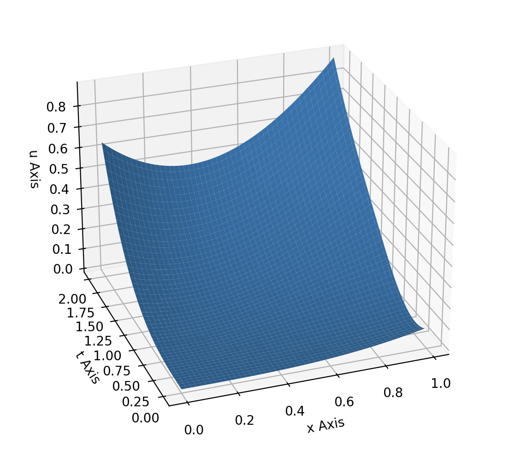

# 8 lab

## Theory
### Transport equastion

In this lab using 3 difference schemes we solve transport equastion:

  

  

  

### Analytical solution

Compare the computational and analytical solution of the following equation:

$
\begin{equation}
 \begin{cases}
    u_t' + u_x'= tx
    \\
   u(0, x) = \frac{x^3}{12}
   \\
   u(t, 0) = \frac{t^3}{12}  
 \end{cases}
\end{equation}
$

Analytical solution:

  

Where c = 1

  

My computational solution:

  

Prooved by analytical method